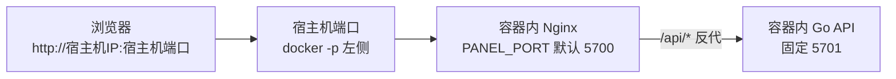

<p align="center">
  
</p>

<h1 align="center">呆呆面板</h1>

<p align="center">
  <em>轻量、现代的定时任务管理面板，Docker 一键部署，开箱即用</em>
</p>

<p align="center">
  
  
  
  
  
</p>

---

呆呆面板 (Daidai Panel) 是一款轻量级定时任务管理平台，采用 Go (Gin) + Vue3 (Element Plus) + SQLite 架构，专注于脚本托管与自动化任务调度。支持 Python、Node.js（含 `.js` / `.mjs`）、Shell、TypeScript、Go 等多语言脚本的定时执行与可视化管理，内置 18 种消息推送渠道、订阅管理、环境变量、依赖管理、Open API 等功能。Docker 一键部署，开箱即用。

> 最新稳定版：`v2.2.15` · [更新日志](./docs/release-notes/v2.2.15.md)<br>
> 本次重点：Telegram Topic 推送、低分辨率列表可见性修复、Docker 健康检查与 Alpine 运行时依赖链路优化。

## 功能特性

- **定时任务** — Cron 表达式调度，支持重试、超时、定时停止、任务依赖、前后置钩子
- **脚本管理** — 在线代码编辑器，支持 Python、Node.js（含 `.mjs`）、Shell、TypeScript、Go，拖拽移动文件
- **执行日志** — SSE 实时日志流，历史日志查看与自动清理
- **环境变量** — 分组管理、拖拽排序、批量导入导出（兼容青龙格式）
- **订阅管理** — 自动从 Git 仓库拉取脚本，支持定期同步
- **依赖管理** — 可视化安装/卸载 Python (pip) 和 Node.js (npm) 依赖
- **通知推送** — Bark、Telegram、Server酱、企业微信、钉钉、飞书等 18 种渠道
- **开放 API** — App Key / App Secret 认证，支持第三方系统对接
- **系统安全** — 双因素认证 (2FA)、IP 白名单、登录日志、多设备会话管理
- **数据备份** — 一键备份与恢复，支持每天/每周/每月定时备份
- **系统监控** — 实时 CPU / 内存 / 磁盘监控，任务执行趋势统计

<details>
<summary><b>点击展开查看详细功能</b></summary>

### 定时任务管理
- 标准 Cron 表达式调度
- 常用时间规则快捷选择
- 任务启用/禁用状态切换
- 手动触发执行
- 任务超时控制与重试机制
- 前后置钩子（任务依赖链）
- 多实例并发控制

### 脚本文件管理
- 在线代码编辑器（语法高亮）
- 支持创建、重命名、删除文件
- 支持文件上传与拖拽移动
- 脚本版本管理
- 调试运行与实时日志输出
- 支持 `.mjs` 脚本调试与任务执行

### 执行日志
- SSE 实时日志流
- 执行状态追踪（成功/失败/超时/手动终止）
- 执行耗时统计
- 日志自动清理策略

### 环境变量
- 安全存储敏感配置
- 变量值脱敏显示
- 分组管理与拖拽排序
- 批量导入导出（兼容青龙格式）
- 任务执行时自动注入

### 订阅管理
- Git 仓库自动拉取
- 定期同步（Cron 调度）
- SSH Key / Token 认证
- 白名单/黑名单过滤

### 消息推送
- 18 种主流推送渠道
- 任务执行结果通知
- 系统事件告警
- 自定义推送模板

### 系统设置
- 双因素认证 (2FA / TOTP)
- IP 白名单
- 登录日志与多设备会话管理（可配置网页端 / APP 端最大会话数）
- 数据备份与恢复（含视图数据）
- 定时备份（每天 / 每周 / 每月）
- 面板标题与图标自定义

</details>

## 效果图

<details>
<summary><b>点击展开查看界面截图</b></summary>

| 功能 | 截图 |
|------|------|
| 仪表盘 |  |
| 定时任务 |  |
| 执行日志 |  |
| 用户管理 |  |
| 脚本管理 |  |
| 环境变量 |  |
| 订阅管理 |  |
| 通知渠道 |  |
| Open API |  |
| 依赖管理 |  |
| 系统设置 |  |
| 个人设置 |  |

</details>

## 快速部署

面板官方推荐用 Docker 部署。下面的例子默认浏览器访问 `http://宿主机IP:5700`。

### 一键启动（Alpine 运行时）

```yaml
# docker-compose.yml
name: daidai-panel

services:
  daidai-panel:
    image: docker.1ms.run/linzixuanzz/daidai-panel:latest
    container_name: daidai-panel
    restart: unless-stopped
    ports:
      - "5700:5700"                                # 宿主机端口:容器内 Nginx 端口
    volumes:
      - ./Dumb-Panel:/app/Dumb-Panel               # 面板数据目录，升级保留
    environment:
      - TZ=Asia/Shanghai
      - CONTAINER_NAME=daidai-panel
      - IMAGE_NAME=docker.1ms.run/linzixuanzz/daidai-panel:latest
    labels:
      - com.centurylinklabs.watchtower.enable=true

  watchtower:
    image: nickfedor/watchtower:latest
    container_name: daidai-watchtower
    restart: unless-stopped
    volumes:
      - /var/run/docker.sock:/var/run/docker.sock
    labels:
      - com.centurylinklabs.watchtower.enable=false
    environment:
      - PANEL_UPDATE_MANAGER=watchtower
    command:
      - --label-enable
      - --cleanup
      - --interval
      - "3600"
```

```bash
docker compose up -d
```

首次访问 `http://localhost:5700` 会进入管理员初始化。

> `docker.1ms.run/` 是 Docker Hub 镜像加速前缀，实际仓库仍是 `linzixuanzz/daidai-panel`。需要换源就改这段。

这份 compose 已经是推荐的可直接上线版本：

1. 面板容器只挂业务数据目录 `./Dumb-Panel:/app/Dumb-Panel`
2. `docker.sock` 只暴露给 Watchtower，不暴露给面板容器
3. 只有打了 `com.centurylinklabs.watchtower.enable=true` 标签的容器会被自动更新
4. Watchtower 自己显式打了 `com.centurylinklabs.watchtower.enable=false`，避免被这套规则误纳入管理
5. `--cleanup` 会在更新后清理旧镜像
6. `--interval 3600` 表示每 1 小时检查一次更新
7. 当前默认使用 `nickfedor/watchtower:latest`，用于兼容新版 Docker API

如果你不想自动更新，可以直接删除 `watchtower` 服务和 `labels`，然后改成在宿主机手动执行：

```bash
docker compose pull
docker compose up -d
```

想用 `docker run` 而不是 compose，推荐等价方式是分别启动面板容器和 Watchtower 容器：

```bash
docker run -d --pull=always \
  --name daidai-panel \
  --restart unless-stopped \
  -p 5700:5700 \
  -v $(pwd)/Dumb-Panel:/app/Dumb-Panel \
  -e TZ=Asia/Shanghai \
  -e CONTAINER_NAME=daidai-panel \
  -e IMAGE_NAME=docker.1ms.run/linzixuanzz/daidai-panel:latest \
  --label com.centurylinklabs.watchtower.enable=true \
  docker.1ms.run/linzixuanzz/daidai-panel:latest

docker run -d \
  --name daidai-watchtower \
  --restart unless-stopped \
  -v /var/run/docker.sock:/var/run/docker.sock \
  --label com.centurylinklabs.watchtower.enable=false \
  nickfedor/watchtower:latest \
  --label-enable \
  --cleanup \
  --interval 3600
```

### 生产版 Watchtower（定时窗口 + 通知 + 滚动更新）

仓库里另外提供了一份更稳妥的生产版配置：

- [docker-compose.watchtower.prod.yml](./docker-compose.watchtower.prod.yml)
- [.env.watchtower.prod.example](./.env.watchtower.prod.example)

推荐用法：

```bash
cp .env.watchtower.prod.example .env.watchtower.prod
# 按你的环境修改 .env.watchtower.prod
docker compose -f docker-compose.watchtower.prod.yml --env-file .env.watchtower.prod up -d
```

仓库里也直接附带了一份默认成品配置：

- [.env.watchtower.prod](./.env.watchtower.prod)

这份默认值已经按“**每天凌晨 04:00 维护窗口检查更新 + Push Plus 通知占位**”写好。你只需要把里面的 `PUSHPLUS_TOKEN` 改成自己的 token，就可以直接启动：

```bash
docker compose -f docker-compose.watchtower.prod.yml --env-file .env.watchtower.prod up -d
```

这份生产版和基础版的区别：

1. 用 `WATCHTOWER_SCHEDULE` 固定在维护窗口更新，而不是按固定秒数轮询
2. 开启 `WATCHTOWER_NOTIFICATION_REPORT=true`，每次更新会发汇总通知
3. 预留 `WATCHTOWER_NOTIFICATION_URL`，可以直接接 Slack / Discord / Gotify 等 Shoutrrr 通道，也可以接 Push Plus
4. 预留 `WATCHTOWER_HTTP_API_TOKEN` 与 `WATCHTOWER_HTTP_API_URL`，用于面板后台手动触发 Watchtower 立即检查更新
5. 开启 `--rolling-restart`，Watchtower 会按容器逐个更新，而不是一次性把所有被它管理的容器一起停掉
6. 配置了 `--stop-timeout 30s`、`healthcheck` 和 `--http-api-update`，更适合生产环境下的优雅停机、手动触发与状态探测

Push Plus 说明：

1. Watchtower 使用的是 Shoutrrr 通知层，Shoutrrr 没有原生 Push Plus 服务名
2. 但可以通过 **Generic Webhook** 正常接入 Push Plus 的 `POST https://www.pushplus.plus/send`
3. 示例地址已经写在 [.env.watchtower.prod.example](./.env.watchtower.prod.example) 和默认成品 [.env.watchtower.prod](./.env.watchtower.prod) 里，替换 token 即可使用

Watchtower 托管说明：

1. 当前推荐的 Watchtower 镜像为：
   - `nickfedor/watchtower:latest`
2. 这样做的原因是部分旧版 Watchtower 在新版 Docker daemon 上会报：
   - `client version 1.25 is too old. Minimum supported API version is 1.40`
3. 生产版配置已预留 HTTP API 参数，面板后台可在识别到 Watchtower 托管模式后提供“手动触发一次检查”的入口

关于 `--rolling-restart`，这里有个边界要说明：

- 如果你让 Watchtower 同时管理多个业务容器，它会一个一个更新，避免“全部同时重启”
- 但如果你当前只有**单实例**的 `daidai-panel`，升级时依然会有一次短暂重启中断
- 真正接近零停机，需要反向代理 + 多实例 / 蓝绿发布，而不是只靠 Watchtower

#### 生产运维建议

1. 单实例部署建议把维护窗口放在业务低峰期，比如每天凌晨 `04:00`
2. 如果你对稳定性要求更高，可以先把镜像 tag 固定到明确版本，再由你手动切换版本号，Watchtower 只负责执行已确认版本的重启
3. 建议至少保留一种外部通知渠道，避免更新失败后只有容器日志里能看到
4. 单实例场景下，更新前用户正在打开的页面会经历一次短暂中断，这是正常现象
5. 如果你还托管了反向代理、数据库、监控等多个容器，`--rolling-restart` 能避免它们被 Watchtower 同时重启
6. 如果你后续准备追求更低中断时间，下一步应考虑“反向代理 + 双实例/蓝绿发布”，而不是继续在单实例上堆参数

#### 更新前后通知说明

1. Watchtower 的通知是**事件通知**，会在检查、发现更新、拉取、重启、失败等阶段发出报告
2. 当前生产版已开启 `WATCHTOWER_NOTIFICATION_REPORT=true`，会尽量发汇总结果
3. 这不等价于“应用级业务健康验证”，它能告诉你容器是否更新完成，但不能替代你自己的业务巡检
4. 如果你希望更严格，可以额外加一个宿主机定时任务，在更新窗口结束后请求 `http://127.0.0.1:5700/api/health` 并把结果再次推送到 Push Plus

### 支持的 CPU 架构

镜像是 multi-arch manifest list，`docker pull` 时按你机器自动选对应平台：

| 架构 | 典型机器 |
|------|---------|
| `linux/amd64` | x86_64 服务器、PC、绝大多数 NAS |
| `linux/arm64` | 树莓派 4 / 5、Oracle ARM 云、Apple Silicon |
| `linux/386` | **v2.0.9 新增**：32 位 x86 老 PC、瘦客户端（仅 `:latest` 有，`:debian` 无） |
| `linux/arm/v7` | **v2.0.9 新增**：树莓派 2 / 3 / Zero 2W、老 ARMv7 盒子 / 路由器 / NAS |

### Alpine vs Debian 运行时

面板提供两套运行时镜像，差别只在容器内的包管理器：

| Tag | 基础镜像 | Linux 包管理 | 支持架构 | 适合谁 |
|-----|---------|-------------|---------|--------|
| `linzixuanzz/daidai-panel:latest` / `:<版本>` | `alpine:3.19` | `apk` | amd64 / arm64 / 386 / arm/v7 | 默认推荐，绝大多数场景 |
| `linzixuanzz/daidai-panel:debian` | `node:20 bookworm-slim` | `apt` | amd64 / arm64 / arm/v7 | 需要安装只在 Debian/Ubuntu 仓库存在、`apk` 没打包的 Linux 软件 |

切到 Debian 运行时：

```bash
# 仓库里有现成的 compose
docker compose -f docker-compose.debian.yml up -d

# 或基于源码本地构建
docker build --build-arg VERSION=2.2.15 -f Dockerfile.debian -t daidai-panel:debian-local .
```

### Windows 单机版（不走 Docker）

**v2.1.0 新增**：Windows 用户可以直接下载编译好的 zip 解压运行，面板内置 Go 后端同时托管前端（无需 Nginx / Docker）。

1. 去 [GitHub Release](https://github.com/linzixuanzz/daidai-panel/releases) 下载 `daidai-windows-amd64.zip` 解压到任意目录（建议路径无空格、无中文，例如 `D:\daidai-panel`）。
2. 双击 `start.bat` 启动服务。
3. 浏览器访问 `http://localhost:5700`，首次进入创建管理员账号。

解压后目录：

```
daidai-panel-windows-amd64/
├── daidai-server.exe     # 后端主程序（同端口同时服务前端）
├── ddp.exe               # 运维 CLI
├── web/                  # 前端静态资源（Go 通过 web_dir 直接托管）
├── config.yaml           # 端口 / 数据目录配置
├── start.bat             # 启动脚本（chcp 65001 兜底中文显示）
├── README.txt            # 详细使用说明
└── Dumb-Panel/           # 首次启动时自动创建，含数据库 / 脚本 / 日志 / 备份
```

**可选：脚本执行环境**。如需面板调度 Python / Node.js 脚本，请自行安装 Python 3.10+ 和 Node.js 20 LTS 并勾选 "Add to PATH"，重启 `start.bat` 即可（`ddp.exe`、脚本执行器会从 PATH 找到对应的 `python` / `node`）。

**升级**：优先在面板后台进入「系统设置」→「概览」→「检查系统更新」→「立即更新」。二进制后台更新会自动下载对应平台的 Release 包，替换程序与前端文件，并保留现有 `config.yaml`、`Dumb-Panel\`、`data\`、`logs\`、`backups\` 等本地配置和数据目录。只有在程序目录没有写入权限、网络无法访问 GitHub Release，或后台更新失败时，才需要手动下载新版 zip 后迁移数据。

### Android Magisk 模块（Root 手机）

在已 Root 的 Android 设备上直接跑面板，无需 Docker、无需 Termux。模块会在安装阶段下载一份 Alpine 3.18 minirootfs 到 `/data/daidai`，在容器里 `apk` 装好 Python / Node.js / Git 等运行时，然后通过 `rurima` 进入容器启动后端，开机自启。

- **支持**：Magisk v24.0+ / KernelSU / APatch；Android 8.0+；`arm64` 或 `x86_64`
- **默认访问**：`http://127.0.0.1:5700`，后端绑定 `0.0.0.0`，局域网 / 内网穿透可直连
- **一键更新**：模块 `updateJson` 自动推送新版 ZIP，升级保留数据
- **下载**：[GitHub Release](https://github.com/linzixuanzz/daidai-panel/releases) 里的 `daidai-panel-magisk-vX.Y.Z.zip`

> 📱 **完整的安装 / 升级 / 卸载 / 端口配置 / 排障文档请看 → [`Magisk/README.md`](./Magisk/README.md)**

## 端口与反向代理

### 端口三兄弟

面板在容器内有 **3 个端口**，搞清它们，大多数部署问题都会消失：

| 端口 | 由谁决定 | 默认 | 要不要改 |
|------|---------|------|----------|
| **宿主机端口** | docker `-p` 左侧 | `5700` | 常改 |
| **容器内 Nginx 端口** | 环境变量 `PANEL_PORT`，`-p` 右侧应与其一致 | `5700` | 基本不改 |
| **容器内 Go 后端端口** | 环境变量 `SERVER_PORT` | `5701` | **不要改** |



两条经验记住就够用：

1. **Docker 部署通常只改 `-p` 左侧**，右侧保持 `5700` 即可。
2. **宿主机 Nginx / 宝塔 / Caddy 反代的目标是宿主机端口**（比如 `127.0.0.1:5700`），**别直接代理到容器内 `5701`**——SSE 会断流、鉴权会丢。

### 想改端口

**只改宿主机端口**（最常见，比如让浏览器走 8080）：

```yaml
ports:
  - "8080:5700"
```

**连容器内 Nginx 端口一起改**（只在容器内 5700 和其他服务冲突时）：`-p` 右侧必须和 `PANEL_PORT` 一致，Go 后端 `5701` 不受影响。

```bash
docker run -d --name daidai-panel \
  -p 8080:7100 \
  -e PANEL_PORT=7100 \
  ...
```

### Magisk 模块（Android Root）改端口

Magisk 模块版和 Docker 结构不一样：没有容器内 Nginx，前端 / 后端都由单个 `daidai-server` 二进制在 `PANEL_PORT` 上直接托管，**不要**直接去改 `config.yaml`——每次开机 `service.sh` 都会按 `ports.conf` 重新生成 `config.yaml`，手动改的内容会被覆盖。

改端口的唯一入口是编辑持久化目录下的 `ports.conf`：

```bash
su
vi /data/adb/daidai-panel/ports.conf
```

> 首次安装模块时会自动生成这个文件，内容带注释，直接修改对应的值即可。

里面有三个可选变量：

| 变量 | 作用 | 默认 |
|------|------|------|
| `PANEL_PORT` | 浏览器访问面板的端口（绑定 `0.0.0.0`，本机 / 局域网 / 内网穿透都能连） | `5700` |
| `SSH_PORT` | 容器内 SSH 端口（adb / Termux 登入容器调试用） | `22` |
| `EXTRA_CORS_ORIGINS` | 额外 CORS 白名单，英文逗号分隔。仅在跨域场景需要（如内网穿透公网端口与面板端口不同，或自定义域名访问） | 空 |

示例：

```ini
PANEL_PORT=6700
SSH_PORT=2222
EXTRA_CORS_ORIGINS="https://panel.example.com,https://xx.trycloudflare.com"
```

改完后重启手机，或手动执行以下命令让配置立即生效：

```bash
su -c "sh /data/adb/modules/daidai-panel/service.sh"
```

生效后在 Magisk / KernelSU / APatch 管理器里点模块卡片的「运行」按钮，可以看到当前 `PANEL_PORT` / `SSH_PORT` 的实际监听状态。完整的 Magisk 模块安装 / 升级 / 卸载文档见 [`Magisk/README.md`](./Magisk/README.md)。

### 反向代理示例

最常见是 **宿主机 Nginx → Docker 已发布端口**。面板暴露在宿主机 `5700`，反代就指向那里：

<details>
<summary><b>宿主机 Nginx 示例（HTTPS，含 SSE 支持）</b></summary>

```nginx
map $http_upgrade $connection_upgrade {
    default upgrade;
    '' close;
}

server {
    listen 443 ssl http2;
    server_name your-domain.com;

    ssl_certificate     /path/to/fullchain.pem;
    ssl_certificate_key /path/to/privkey.pem;

    location / {
        proxy_pass http://127.0.0.1:5700;   # 宿主机端口，不是容器内 5701

        proxy_set_header Host $host;
        proxy_set_header X-Real-IP $remote_addr;
        proxy_set_header X-Forwarded-For $proxy_add_x_forwarded_for;
        proxy_set_header X-Forwarded-Proto https;

        proxy_http_version 1.1;
        proxy_set_header Upgrade $http_upgrade;
        proxy_set_header Connection $connection_upgrade;

        proxy_buffering off;                 # SSE 日志流必须关
        proxy_read_timeout 300s;
    }
}
```

</details>

如果反代本身也跑在同一 Docker 网络里，可以直接代理到 `http://daidai-panel:5700`（依然是容器内 Nginx 端口）。

**别做的事**：

- 让浏览器或反代绕过容器内 Nginx 直接访问 Go 后端 `5701`
- 把 SSE / 下载 / 鉴权接口单独绕出去
- 让 `-p` 右侧容器端口和 `PANEL_PORT` 不一致

## 更新

### 面板内一键更新（推荐）

进入「系统设置」→「概览」→ 点「检查系统更新」。系统会自动识别当前部署方式：

- **Docker 部署**：需要在 `docker-compose.yml` 里挂载 `/var/run/docker.sock`，更新时拉取最新镜像并按当前容器参数重建。
- **二进制部署**：自动匹配 `daidai-windows-amd64.zip` 或 `daidai-linux-*.tar.gz`，后台下载、解压、替换程序和 `web/` 前端文件，更新过程会跳过 `config.yaml` 与数据目录，避免覆盖服务器本地配置。

### 手动更新

```bash
# Alpine 运行时
docker pull docker.1ms.run/linzixuanzz/daidai-panel:latest
docker compose up -d

# Debian 运行时
docker pull docker.1ms.run/linzixuanzz/daidai-panel:debian
docker compose -f docker-compose.debian.yml up -d
```

本地基于源码自己构建的镜像，重新 build 即可：

```bash
docker build --build-arg VERSION=2.2.15 -f Dockerfile.debian -t daidai-panel:debian-local .
```

## 容器命令 `ddp`

容器里预置了 `ddp` CLI，覆盖运维、脚本 / 变量 / 任务 / 订阅管理、账号恢复等场景。统一入口：

```bash
docker exec -it daidai-panel ddp <subcommand>
```

> 没叫 `dd` 是因为会和 Linux 自带 `dd` 命令冲突。

### 状态与自检

```bash
ddp help                 # 查看所有子命令
ddp status               # 版本、数据目录、端口、任务数、资源占用、服务状态
ddp check                # 检查配置、数据库、运行目录、运行时命令、Docker Socket
ddp logs --lines 200     # 查看 panel.log
```

### 脚本

```bash
ddp script list
ddp script cat demo.py
ddp script fetch https://example.com/test.py --path tools/test.py
```

### 环境变量

```bash
ddp env list
ddp env get JD_COOKIE
ddp env set JD_COOKIE "pt_key=xxx;pt_pin=yyy;" --group 京东
ddp env delete <id>
```

### 任务与订阅

```bash
ddp task list --status running
ddp task logs 12 --lines 80
ddp task run 12                 # 同步执行任务并实时输出
ddp task stop 12                # 终止运行中的任务

ddp sub list
ddp sub logs 3 --lines 100
ddp sub pull 我的订阅            # 立即执行一次订阅拉取
```

### 运维

```bash
ddp restart                     # 重启容器内 daidai-server 进程
ddp update                      # 复用面板一键更新链路
ddp clean-logs 7                # 清理 7 天前的任务日志文件
ddp backup create --name nightly
ddp backup list
ddp backup restore <name>
ddp backup delete <name>
```

### 账号恢复（忘了密码 / 用户名）

```bash
ddp list-users                              # 忘了用户名先看这个
ddp reset-password admin NewPass123         # 单用户时可省略用户名
ddp reset-username admin newadmin
ddp disable-2fa admin                       # 传 --all 则全员禁用
ddp reset-login --all                       # 清登录失败次数，解锁被锁账号
```

> **忘记密码怎么办**：`docker exec -it daidai-panel ddp list-users` 查出用户名，再 `ddp reset-password <用户名> <新密码>`，不需要删数据重装。

命令也支持直接跑完就退出的一次性形态：

```bash
docker run --rm \
  -v $(pwd)/Dumb-Panel:/app/Dumb-Panel \
  docker.1ms.run/linzixuanzz/daidai-panel:latest \
  ddp version
```

## 数据目录

默认挂在 `./Dumb-Panel`，保留这一个目录 = 保留整个面板状态：

```
Dumb-Panel/
├── daidai.db          # SQLite 数据库
├── .jwt_secret        # 自动生成的 JWT 密钥
├── panel.log          # 面板运行日志
├── deps/              # Python / Node.js 依赖
├── scripts/           # 脚本文件
├── logs/              # 任务执行日志
└── backups/           # 数据备份
```

## 配置参考

面板有两层配置：

- **启动配置**：Docker 环境变量 + `config.yaml`。Docker 部署时由 `entrypoint.sh` 自动生成，一般不需要手动改。
- **运行期配置**：进面板后「系统设置」里改，落到 SQLite 的 `system_configs` 表，重启不丢失。完整项目清单见 [系统配置与运维说明](./docs/system-config-operations.md)。

### Docker 环境变量

| 变量 | 说明 | 默认 |
|------|------|------|
| `TZ` | 时区 | `Asia/Shanghai` |
| `DATA_DIR` | 数据目录 | `/app/Dumb-Panel` |
| `DB_PATH` | 数据库路径 | `${DATA_DIR}/daidai.db` |
| `PANEL_PORT` | 容器内 Nginx 端口 | `5700` |
| `SERVER_PORT` | 容器内 Go 后端端口（**不要改**） | `5701` |
| `CONTAINER_NAME` / `IMAGE_NAME` | 面板内一键更新识别自己用 | 空 |

## 技术栈

| 层 | 技术 |
|----|------|
| 前端 | Vue 3 + TypeScript + Element Plus + Pinia + Vite + Monaco Editor |
| 后端 | Go 1.25 + Gin + GORM + SQLite（`glebarez/sqlite` 纯 Go port，`CGO_ENABLED=0`） |
| 部署 | Nginx + Go Binary，Docker 多架构镜像：`linux/amd64` / `linux/arm64` / `linux/386` / `linux/arm/v7` |

## 致谢

本项目的开发离不开以下优秀的开源项目：

- **[白虎面板 (Baihu Panel)](https://github.com/engigu/baihu-panel)** — 后端框架架构参考，部分代码基于白虎面板改进
- **[青龙面板 (Qinglong)](https://github.com/whyour/qinglong)** — 功能设计参考，定时任务管理、环境变量、订阅管理等核心功能借鉴自青龙面板

感谢以上项目作者的贡献！

## LICENSE

Copyright © 2026, [linzixuanzz](https://github.com/linzixuanzz). Released under the [MIT](LICENSE).
